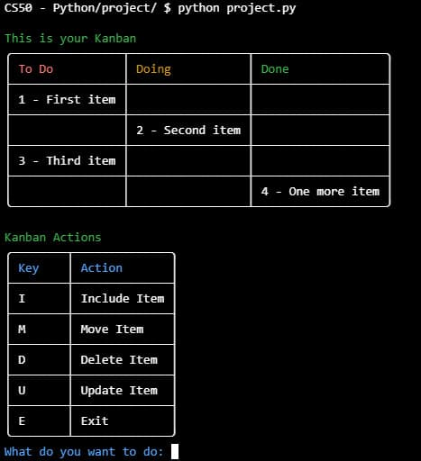

# Kanpy
#### Video Demo:  [CS50’s Introduction to Programming with Python - Final project](https://youtu.be/V7HFOg4AgD0)
#### Description: This project is a command-line interface Kanban board created using Python for [CS50's Introduction to Programming with Python](https://www.edx.org/learn/python/harvard-university-cs50-s-introduction-to-programming-with-python?webview=false&campaign=CS50%27s+Introduction+to+Programming+with+Python&source=edx&product_category=course&placement_url=https%3A%2F%2Fwww.edx.org%2Fcs50) final project.

## What a Kanban is?
The Japanese word kanban means "visual board", "sign" or "card" and could be used to refer to a signalling system that uses cards.

Various methodologies and frameworks used in agility, such as Scrum, for example, use a board that we can call a "Kanban board", in which we have some cards that move around the board, in other words, some "kanbans".

In general, the Kanban system has three different phases:
1. **To Do**: represents the tasks or items that have yet to be done. This is the first stage of the process, in which demands are registered and prioritised.  This column or section on the Kanban board serves as a reservoir for future activities.

2. **Doing**: in this stage, the tasks previously belonging to the "To Do" column are moved to the "Doing" column and assigned to team members. Work is then started and progresses to completion. This column on the Kanban board shows the tasks that are being worked on and in the process of being carried out.

3. **Done**: when a task is finalised, it is moved to the "Done" column on the Kanban board. The "Done" column serves as a visual indicator of tasks that have been successfully completed.

## About this project
This project is a command-line interface Kanban board created using Python for "CS50's Introduction to Programming with Python" final project.

It uses a csv file to save the items/activities to be included in the board.

If the file does not exist it will be created. The head of the csv fil is the activity **ID**, the activity **Status** and the activity **Title**.
* **ID** - the number of the activity. It will be useful for selecting the activity and atribute a action for it.
* **Status** - it is the status of the activity according to the kanban board: To Do, Doing or Done
* **Title** - it is the title of the activity.

The following are the ways to interact with the board (case-insensitive):
* **I** - to include a new item/activity to the board. It will be included in last.
* **M** - to move the activity to its status: To Do, Doing or Done.
* **U** - to update the title of the activity.
* **D** - to delete the activity.
* **E** - to close the program.

## Screenshot of the command-line



## Usage
To use this project you need to instal the following libraries:

```python
pip install tabulate
pip install colorama
```


